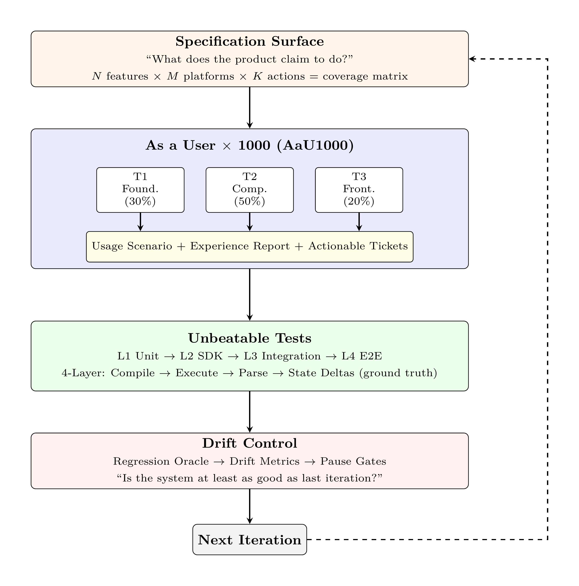
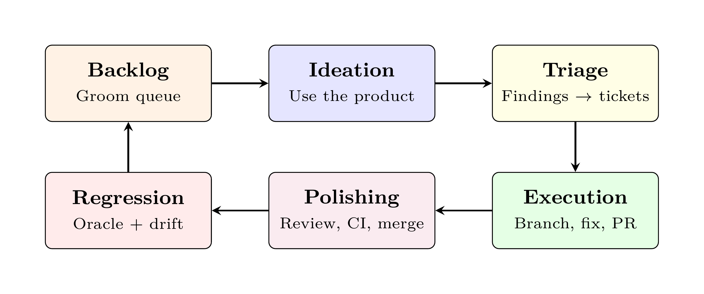

# The Kitchen Loop

### User-Spec-Driven Development for a Self-Evolving Codebase

*By Yannick Roy — [arXiv Paper](https://arxiv.org/abs/2603.25697) | [How-To Guide](docs/howto.md)*

<a href="https://youtu.be/dcFWapTGMT8">
  
</a>

An autonomous AI coding framework where an LLM agent uses your product as a synthetic power user at **~1,000x human cadence**, validates every change through **unbeatable tests**, and controls drift and regression before merging. The product evolves itself.

> **⚠️ Disclaimer — Shared "As Is"**
>
> This is **not** a polished, turnkey product. It is a working framework that requires a competent human operator to adapt it to their project. Instead of raising money and building a closed product, I chose to share these insights, techniques, and tooling with the dev community — **for free, open source** — so others can accelerate their own productivity.
>
> There are no warranties. I am not responsible for bugs, data loss, or unexpected behavior. You are expected to read the code, understand what it does, and use it responsibly. If it breaks, you get to keep both pieces.
>
> **Use it. Learn from it. Make it your own. But run it at your own risk.**

## Key Concepts

**Specification Surface** — The enumerable set of capabilities your product claims to support. *N* features x *M* platforms x *K* actions = your coverage matrix. The loop systematically exercises every cell.

**"As a User x 1000" (AaU1000)** — Don't close tickets. *Be the user.* The agent exercises your product the way a power user would — at 1,000x the cadence. Three tiers: Foundation (30%), Composition (50%), Frontier (20%).

**Unbeatable Tests** — Ground-truth verification the code author cannot fake. 4-layer pattern: Compile → Execute → Parse → State Deltas. In our deployments, 38 passing unit tests coexisted with complete feature failure. The UAT gate caught it.

**Regression Oracle** — A repeatable, bounded test that answers one question: *"Is the system at least as good as before?"* If no → the loop pauses. If yes → next iteration.

**Drift Control** — Continuous measurement of quality trends with automated pause gates. The loop halts itself when metrics degrade. No human needed.

**UAT Gate** — After every implementation, a *fresh agent* (zero context, weakest model, read-only, isolated worktree) verifies the feature works from a user's perspective. Sealed test card. No cheating.

<p align="center">
  
</p>

## The Six-Phase Loop

Every iteration runs all six phases. Every phase has a job. Nothing ships without passing the full stack.

| Phase | What happens | Time |
|-------|-------------|------|
| **Backlog** | Prioritize coverage gaps in your spec surface |
| **Ideation** | Exercise the product as a real user would. Document what breaks. |
| **Triage** | Convert findings into prioritized tickets with root causes |
| **Execution** | Branch, implement, write tests, open PR |
| **Polishing** | Multi-model review (Codex, Gemini, CodeRabbit), CI, merge |
| **Regression** | Run the regression oracle. Measure drift. Update loop state. |

<p align="center">
  
</p>

---

## Quickstart

```bash
# 1. Clone KitchenLoop
git clone https://github.com/0xagentkitchen/kitchenloop.git

# 2. Navigate to YOUR project
cd /path/to/your/project

# 3. Initialize (generates kitchenloop.yaml + copies skills)
/path/to/kitchenloop/scripts/kitchenloop-init.sh

# 4. Run a single iteration
./scripts/kitchenloop/kitchenloop.sh 1

# 5. Run 10 iterations overnight
./scripts/kitchenloop/kitchenloop.sh 10
```

### Prerequisites

| Tool | Purpose |
|------|---------|
| [`claude`](https://docs.anthropic.com/en/docs/claude-code) | Claude Code CLI — the AI engine |
| `git`, `gh` | Version control + GitHub CLI |
| `jq`, `yq` | JSON/YAML processing |

Optional (for the [Discussion Manager](whitepaper.pdf)):
[`gemini`](https://github.com/google-gemini/gemini-cli),
[`codex`](https://github.com/openai/codex) — multi-AI debate with anti-sycophancy safeguards.

### Modes

```bash
./scripts/kitchenloop/kitchenloop.sh 3
./scripts/kitchenloop/kitchenloop.sh 10 --mode user-only   # Fill backlog with findings
./scripts/kitchenloop/kitchenloop.sh 5 --mode dev-only     # Drain the backlog
```

### Configuration

All config lives in one file: `kitchenloop.yaml`

```yaml
project:
  name: my-project
  language: python

verification:
  oracle:
    full_command: "pytest"
    quick_command: "pytest tests/smoke/ -x"

spec:
  dimensions:
    features: ["auth", "api", "ui"]
```

> See [`kitchenloop.example.yaml`](kitchenloop.example.yaml) for all available configuration options including paths, reviewers, stop conditions, and runtime thresholds.

---

## What Gets Installed

After running `kitchenloop-init.sh`, your project will contain:

```
your-project/
├── kitchenloop.yaml              # Configuration (edit this)
├── scripts/
│   ├── kitchenloop/              # Orchestrator + prompts + lib
│   ├── pr-manager/               # Automated PR lifecycle
│   └── ai-discussion/            # Multi-AI discussion engine
├── .claude/skills/               # Auto-discovered by Claude Code
│   ├── kitchenloop-ideate/
│   ├── kitchenloop-execute/      # Includes UAT-GATE.md protocol
│   ├── kitchenloop-triage/
│   ├── kitchenloop-regress/
│   ├── kitchenloop-backlog/
│   └── discussion-moderator/
└── .kitchenloop/                 # Logs, quality bar, UAT cards
```

---

## Validated On

| System | Domain | Iterations | PRs | Result |
|--------|--------|-----------|-----|--------|
| Production System A | Multi-chain strategy framework (14 chains, 30+ connectors) | 122+ | 921+ | Zero regressions, quality gates 76% → 100% |
| Production System B | Signal intelligence platform (46+ detection agents) | 163+ | 173+ | Zero regressions, zero Tier-1 canary escapes |

*Details in the [whitepaper](https://arxiv.org/abs/2603.25697).*

---

## The Discussion Manager

For decisions that need judgment — *"Should we build this?"*, *"Which architecture?"* — the loop invokes structured multi-AI debate:

- 3 heterogeneous models (Gemini, Codex, Claude) argue substantive positions
- Blind opening rounds eliminate anchoring bias
- Kill gate: every design must survive a "why NOT to build this" argument
- 23 production discussions across 3 codebases. 100% reached agreement.

```bash
python scripts/ai-discussion/discuss.py "Should we use SQLite or PostgreSQL?" --max-rounds 3
```

---

## Documentation

| | |
|---|---|
| [Whitepaper](https://arxiv.org/abs/2603.25697) | Framework design, method, and production evidence |
| [How-To Guide](docs/howto.md) | Operator manual for running and monitoring |
| [Examples](examples/) | Demo repos: [Pantry](https://github.com/0xagentkitchen/pantry-demo) (Python CLI), [Mise](https://github.com/0xagentkitchen/mise) (FastAPI + JS) |

### Mise Demo — Hands-Free, Self-Evolving

<a href="https://youtu.be/m8jmRrzKIRI">
  
</a>

---

## Next Steps

1. **Ask your AI agent.** *"Hey Claude, how can I use the KitchenLoop in my project? Read the [paper](https://arxiv.org/abs/2603.25697) and the [repo](https://github.com/0xagentkitchen/kitchenloop)."*
2. **Install it.** Follow the [Quickstart](#quickstart) above to initialize on your own codebase.
3. **Try the demo.** Clone the [Pantry Demo](https://github.com/0xagentkitchen/pantry-demo), launch the KitchenLoop, and watch the app evolve automagically.

---

## Contributing

Contributions welcome — especially new example configs for different stacks (Rust CLI, React app, Go microservice, etc.).

## Citation

If you use or reference the Kitchen Loop, please cite:

```bibtex
@misc{roy2026kitchenloop,
  title   = {The Kitchen Loop: User-Spec-Driven Development
             for a Self-Evolving Codebase},
  author  = {Roy, Yannick},
  year    = {2026},
  eprint  = {2603.25697},
  archivePrefix = {arXiv},
  primaryClass  = {cs.SE},
  url     = {https://arxiv.org/abs/2603.25697}
}
```

## License

[MIT](LICENSE)
